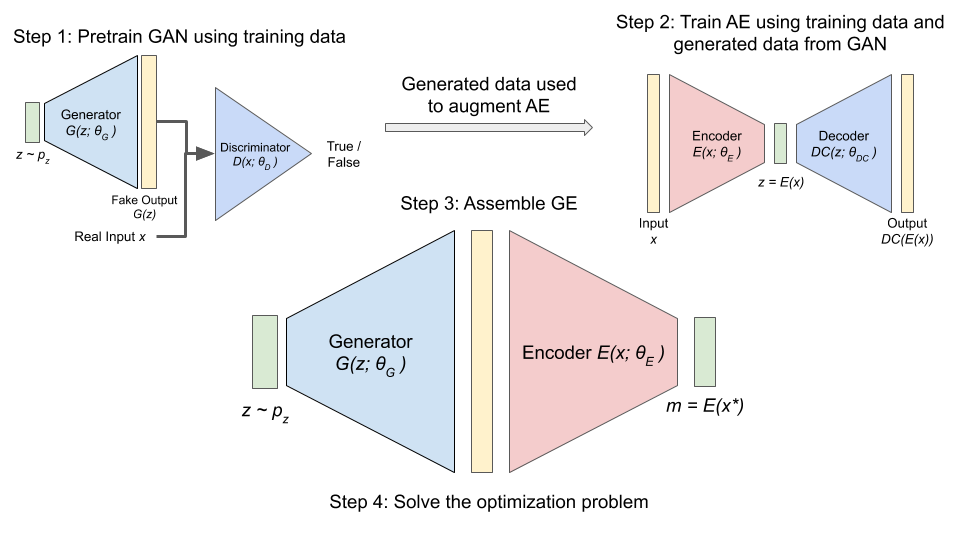

# Generative Imaging and Image Processing via Generative Encoder

Author: [Yong Zheng Ong](https://www.researchgate.net/profile/Yong-Zheng-Ong), [Haizhao Yang](https://haizhaoyang.github.io/)

This repository implements the basic GE model found in the paper:
- [Generative Imaging and Image Processing via Generative Encoder](https://www.aimsciences.org/article/doi/10.3934/ipi.2021060)

The following models are implemented for use in the paper:

**GAN Models**
- Progressive Growing of GAN (PGAN): https://arxiv.org/pdf/1710.10196.pdf (Supports: image)

**AE Models**
- Variational Auto-Encoder (VAE): (Code Referenced From) https://github.com/sksq96/pytorch-vae, https://github.com/atinghosh/VAE-pytorch

### Dataset type legend

| Data Type | Description |
| --- | --- |
| image | Image type supports RGB and Grayscale images, in which the field "dimOutput" in the config file determines which type |

### Dataset preparation

The below code snippets assumes that your datasets are saved in the `dataset_raw` folder

- celebA cropped

Split the dataset into train and test data (either use partitions given by the webpage, or do a 9:1 split). The dataset can be downloaded from [https://mmlab.ie.cuhk.edu.hk/projects/CelebA.html](https://mmlab.ie.cuhk.edu.hk/projects/CelebA.html).

```
python datasets.py celeba_cropped dataset_raw/img_align_celeba/ -o dataset/img_align_celeba/
```

## Running a GE training process



#### Downloads

The below links to some files that can be used to initialize a CelebA training session for GE reconstruction. To know how to implement VAE for other applications, refer to README.txt in the downloaded folder, with instructions on how to configure the config file to take in different input and output folders for VAE.

Folder structure:
```
dataset
    img_align_celeba_train_cropped
        XXX.png
        ...
        YYY.png
    img_align_celeba_test_cropped
        XXX.png
        ...
        YYY.png
config_celeba_cropped_pgan.json
config_celeba_cropped_vae.json
README.txt
```

Download the zip file from the link and copy the files to the root of the repository.

[Google Drive Link](https://drive.google.com/drive/folders/1Xip1PqMiwuLQarYCx5Kvyz4cQ5Am0eyf?usp=sharing)

#### Step 1: Train the GAN model

```
python train.py PGAN --restart -n celeba_pgan_clean -c config_celeba_cropped_pgan.json
```

#### Step 2: Train the VAE model

```
python train.py VAE --restart -n celeba_vae_clean -c config_celeba_cropped_vae.json
```

#### Step 3: Run the GE model

Refer to the folder [tests/generative_encoder](./tests/generative_encoder) for the main code. Update lines 47 to 52 with output scale and iteration for model to load. Update [tests/generative_encoder/test_ge_celeba.sh](./tests/generative_encoder/test_ge_celeba.sh) with position of image to run GE on.

```
bash tests/generative_encoder/test_ge_celeba.sh
```


## CREDITS

The following sources have contributed greatly to the development of this repository:

- GAN Architecture, base code: https://github.com/facebookresearch/pytorch_GAN_zoo
- VAE References: https://github.com/sksq96/pytorch-vae, https://github.com/atinghosh/VAE-pytorch
- Generative Encoder for Image Processing: INSERT LINK TO PAPER ONCE AVAILABLE
- CelebA Dataset: https://mmlab.ie.cuhk.edu.hk/projects/CelebA.html
